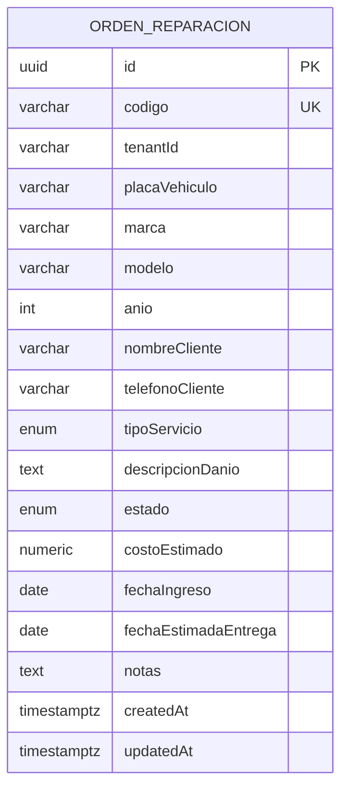

# Diagrama de entidades

## Entidad implementada

La primera etapa persiste los datos de cliente y vehículo dentro de cada orden. No existen todavía tablas independientes para `Cliente`, `Vehiculo` o `Tenant`.

La separación en entidades de taller, cliente, vehículo e ítems de orden queda como evolución futura del modelo.
